<h1 align="center">✋ Gesture-Based Object Control with Computer Vision</h1>

<p align="center">
  Control virtual objects with your hands using <b>OpenCV</b>, <b>cvzone</b>, and <b>NumPy</b>.  
  <br>
  <br>
  <a href="https://github.com/VibecoderAnurag/Gesture-Based-Object-Control-with-Computer-Vision">View Demo</a>
  ·
  <a href="https://github.com/VibecoderAnurag/Gesture-Based-Object-Control-with-Computer-Vision/issues">Report Bug</a>
  ·
  <a href="https://github.com/VibecoderAnurag/Gesture-Based-Object-Control-with-Computer-Vision/issues">Request Feature</a>
</p>

<p align="center">
  
  
  
  
</p>

---

## 🎥 Demo

<p align="center">
  
</p>

---

## ✨ Key Features

<table align="center">
<tr>
<td align="center" width="33%">

### 🖐️ **Right Hand Controls**
**Movement** • Index finger position  
**Rotation** • Hand tilt angle  
*Precise object manipulation*

</td>
<td align="center" width="33%">

### ✋ **Left Hand Controls**  
**Scaling** • Thumb-pinky distance  
**Duplication** • Peace sign gesture ✌️  
*Size and copy control*

</td>
<td align="center" width="33%">

### ⚡ **Realistic Physics**
**Gravity** • Objects fall naturally  
**Bouncing** • Collision detection  
**Friction** • Smooth interactions

</td>
</tr>
</table>

---

## 🛠️ Tech Stack

<div align="center">

| Technology | Purpose | Version |
|------------|---------|---------|
|  | Core Language | 3.10+ |
|  | Computer Vision | 4.8+ |
|  | Mathematical Operations | Latest |
| **cvzone** | Hand Tracking Module | Latest |

</div>

---

## 🧩 System Architecture

```mermaid
flowchart TD
    A[📹 Camera Input<br/>1280x720 @ 30fps] --> B{🤚 Hand Detection<br/>cvzone MediaPipe}
    B --> |Right Hand| C1[👉 Movement Control<br/>Index Finger Position]
    B --> |Right Hand| C2[🔄 Rotation Control<br/>Hand Tilt Angle]
    B --> |Left Hand| C3[📏 Scale Control<br/>Thumb-Pinky Distance]
    B --> |Left Hand| C4[✌️ Gesture Recognition<br/>Peace Sign Detection]
    
    C1 --> D[🎯 Object Control Logic]
    C2 --> D
    C3 --> D
    C4 --> D
    
    D --> E[⚡ Physics Engine]
    E --> F1[⬇️ Gravity System]
    E --> F2[🏀 Collision Detection]
    E --> F3[🚧 Boundary Checks]
    
    F1 --> G[🎨 Rendering Pipeline]
    F2 --> G
    F3 --> G
    
    G --> H1[📐 Scale Transform]
    G --> H2[🔄 Rotation Matrix]
    G --> H3[🎭 Transparency Mask]
    
    H1 --> I[✨ Real-time Display]
    H2 --> I
    H3 --> I
    
    classDef inputNode fill:#e1f5fe,stroke:#01579b,stroke-width:2px
    classDef handNode fill:#f3e5f5,stroke:#4a148c,stroke-width:2px
    classDef controlNode fill:#e8f5e8,stroke:#1b5e20,stroke-width:2px
    classDef physicsNode fill:#fff3e0,stroke:#e65100,stroke-width:2px
    classDef renderNode fill:#fce4ec,stroke:#880e4f,stroke-width:2px
    classDef outputNode fill:#f1f8e9,stroke:#33691e,stroke-width:3px
    
    class A inputNode
    class B handNode
    class C1,C2,C3,C4 controlNode
    class D,E controlNode
    class F1,F2,F3 physicsNode
    class G,H1,H2,H3 renderNode
    class I outputNode
```



---

## 🚀 Quick Start

### Prerequisites
```bash
pip install opencv-python cvzone numpy
```

### Installation & Usage
```bash
# Clone the repository
git clone https://github.com/VibecoderAnurag/Gesture-Based-Object-Control-with-Computer-Vision.git
cd Gesture-Based-Object-Control-with-Computer-Vision

# Run the application
python main.py
```

### Controls
| Key | Action |
|-----|--------|
| `c` | Capture object in green box |
| `1-5` | Select different objects |
| `r` | Reset all objects |
| `q` | Quit application |

---

## 🎮 How It Works

<div align="center">

### **Step 1: Capture** 📦
Place object in green capture zone and press `c`

### **Step 2: Control** 🕹️
Use **right hand** to move and rotate, **left hand** to scale

### **Step 3: Physics** ⚡
Release hands to let objects fall with realistic physics

### **Step 4: Duplicate** ✌️
Make peace sign with left hand to create copies

</div>

---

## 🎯 Applications

- **🕹️ Interactive Gaming** - Motion-controlled game mechanics
- **📚 Educational Tools** - Hands-on learning environments  
- **🏥 Accessibility** - Touch-free interfaces for medical settings
- **🎭 AR/VR Development** - Foundation for immersive experiences
- **🎨 Digital Art** - Gesture-based creative tools

---

## 🤝 Contributing

Contributions are welcome! Feel free to:

1. **Fork** the project
2. **Create** your feature branch (`git checkout -b feature/AmazingFeature`)
3. **Commit** your changes (`git commit -m 'Add some AmazingFeature'`)
4. **Push** to the branch (`git push origin feature/AmazingFeature`)
5. **Open** a Pull Request

---

## 📄 License

This project is licensed under the **MIT License** - see the [LICENSE](LICENSE) file for details.

---

## 🙏 Acknowledgments

- **MediaPipe** team for hand tracking technology
- **cvzone** for simplified computer vision tools
- **OpenCV** community for computer vision foundations

---

<p align="center">
  <b>⭐ Star this repo if you found it helpful!</b>
  <br>
  <br>
  Made with ❤️ by <a href="https://github.com/VibecoderAnurag">VibecoderAnurag</a>
</p>
